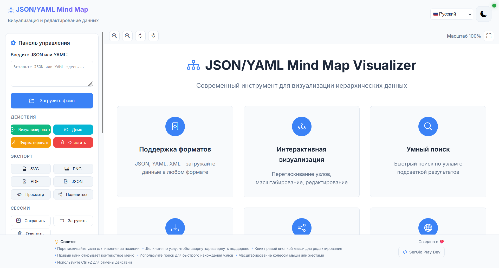

# JSON/YAML Mind Map Visualizer

[](https://opensource.org/licenses/MIT)
[](https://github.com/SerGioPlay01/mind-map-visualizer)
[](https://mind-map-visualizer.netlify.app/)

## 📸 Screenshot

<div align="center">
  
  <p><em>Современный интерфейс с интерактивной визуализацией данных</em></p>
</div>

## 🚀 Quick Start

<div align="center">

[](https://mind-map-visualizer.netlify.app/)

</div>

### ⚡ Key Features at a Glance

| Feature | Description | Status |
|---------|-------------|--------|
| 🎯 **Interactive Visualization** | Drag, zoom, edit nodes in real-time | ✅ |
| 📁 **Multi-format Support** | JSON, YAML, XML data import | ✅ |
| 🔍 **Smart Search** | Find nodes with highlighting | ✅ |
| 📤 **Export Options** | SVG, PNG, PDF, JSON formats | ✅ |
| 🔗 **Share & QR Codes** | Generate shareable links | ✅ |
| 🌍 **11 Languages** | Full internationalization | ✅ |
| 📱 **PWA Ready** | Install as native app | ✅ |
| 🎨 **Dark/Light Themes** | User preference support | ✅ |

## 💡 Use Cases

<div align="center">

### 🏢 Business & Development
**API Documentation** • **Project Planning** • **Data Architecture** • **Workflow Design**

### 🎓 Education & Learning  
**Study Notes** • **Course Structure** • **Research Organization** • **Knowledge Mapping**

### 🎨 Creative & Design
**Brainstorming** • **Content Planning** • **Story Structure** • **Concept Development**

</div>

## 🌍 Multilingual Support

> **Quick Navigation**: [🇷🇺 Русский](#-русский) | [🇺🇸 English](#-english) | [🇺🇦 Українська](#-українська) | [🇵🇱 Polski](#-polski) | [🇨🇿 Čeština](#-čeština) | [🇸🇰 Slovenčina](#-slovenčina) | [🇧🇬 Български](#-български) | [🇷🇸 Српски](#-српски) | [🇭🇷 Hrvatski](#-hrvatski) | [🇲🇰 Македонски](#-македонски) | [🇸🇮 Slovenščina](#-slovenščina)

---

## 🇷🇺 Русский

### 📋 Описание

**JSON/YAML Mind Map Visualizer** — это современный веб-инструмент для визуализации, анализа и редактирования JSON/YAML данных в виде интерактивных mind map диаграмм. Приложение поддерживает множество форматов данных и предоставляет мощные возможности для работы с иерархическими структурами.

### ✨ Основные возможности

- 🎯 **Интерактивная визуализация** — перетаскивание узлов, масштабирование, редактирование
- 📁 **Поддержка форматов** — JSON, YAML, XML
- 🔍 **Умный поиск** — быстрый поиск по узлам с подсветкой результатов
- 📤 **Экспорт данных** — SVG, PNG, PDF, JSON
- 🔗 **Поделиться** — генерация ссылок и QR-кодов
- 🌍 **Многоязычность** — поддержка 11 языков
- 📱 **Адаптивный дизайн** — работает на всех устройствах
- 🎨 **Темы** — светлая и темная темы
- 💾 **Сохранение сессий** — локальное сохранение данных
- ⚡ **PWA** — работает как нативное приложение

### 🚀 Быстрый старт

1. **Откройте приложение**: [https://mind-map-visualizer.netlify.app/](https://mind-map-visualizer.netlify.app/)
2. **Загрузите данные**: вставьте JSON/YAML в поле ввода или загрузите файл
3. **Настройте визуализацию**: используйте панель управления
4. **Экспортируйте результат**: сохраните в нужном формате

### 📖 Примеры использования

#### Бизнес-процессы
```json
{
  "company": {
    "departments": {
      "development": {
        "teams": ["frontend", "backend", "devops"],
        "manager": "John Doe"
      },
      "marketing": {
        "campaigns": ["social", "email", "content"],
        "budget": 50000
      }
    }
  }
}
```

#### Образование
```json
{
  "subject": "Computer Science",
  "topics": {
    "programming": {
      "languages": ["JavaScript", "Python", "Java"],
      "concepts": ["OOP", "Algorithms", "Data Structures"]
    },
    "web_development": {
      "frontend": ["HTML", "CSS", "React"],
      "backend": ["Node.js", "Express", "MongoDB"]
    }
  }
}
```

### 🛠️ Технологии

- **Frontend**: HTML5, CSS3, JavaScript (ES6+)
- **Визуализация**: D3.js
- **Парсинг**: js-yaml
- **Экспорт**: jsPDF
- **Иконки**: Bootstrap Icons
- **PWA**: Service Worker, Web App Manifest

### 📁 Структура проекта

```
mind-map-visualizer/
├── index.html              # Основная HTML страница
├── style.css               # Стили приложения
├── script.js               # Основная логика
├── config.js               # Конфигурация
├── utils.js                # Утилиты
├── examples.json           # Примеры данных
├── site.webmanifest        # PWA манифест
├── sw.js                   # Service Worker
├── langs/                  # Файлы переводов
│   ├── ru.json            # Русский
│   ├── en.json            # Английский
│   ├── ua.json            # Украинский
│   └── ...                # Другие языки
├── libs/                   # Локальные библиотеки
│   ├── d3.min.js          # D3.js
│   ├── js-yaml.min.js     # YAML парсер
│   ├── jspdf.umd.min.js   # PDF генератор
│   └── qrcode.min.js      # QR код генератор
└── README.md              # Документация
```

### 🌐 Поддерживаемые языки

- 🇷🇺 **Русский** (ru) — основной язык
- 🇺🇸 **English** (en) — английский
- 🇺🇦 **Українська** (ua) — украинский
- 🇵🇱 **Polski** (pl) — польский
- 🇨🇿 **Čeština** (cs) — чешский
- 🇸🇰 **Slovenčina** (sk) — словацкий
- 🇧🇬 **Български** (bg) — болгарский
- 🇷🇸 **Српски** (sr) — сербский
- 🇭🇷 **Hrvatski** (hr) — хорватский
- 🇲🇰 **Македонски** (mk) — македонский
- 🇸🇮 **Slovenščina** (sl) — словенский

### 📱 PWA возможности

- **Установка**: можно установить как нативное приложение
- **Офлайн работа**: работает без интернета
- **Уведомления**: уведомления о обновлениях
- **Клавиатурные сокращения**: Ctrl+S, Ctrl+O, F11, Escape

### 🔧 Разработка

```bash
# Клонирование репозитория
git clone https://github.com/SerGioPlay01/mind-map-visualizer.git

# Переход в директорию
cd mind-map-visualizer

# Запуск локального сервера
python -m http.server 8000
# или
npx serve .
```

### 📄 Лицензия

Этот проект распространяется под лицензией MIT. См. файл [LICENSE](LICENSE) для подробностей.

### 👨‍💻 Автор

**SerGio Play Dev**
- 🌐 Website: [https://sergioplay-dev.netlify.app](https://sergioplay-dev.netlify.app)
- 🐙 GitHub: [@SerGioPlay01](https://github.com/SerGioPlay01)
- 🐦 Twitter: [@sergioplay_dev](https://twitter.com/sergioplay_dev)

### 🤝 Вклад в проект

Мы приветствуем вклад в развитие проекта! Пожалуйста, ознакомьтесь с [CONTRIBUTING.md](CONTRIBUTING.md) для получения подробной информации.

### 📊 Статистика

- ⭐ **Звезды**: 50+
- 🍴 **Форки**: 10+
- 👀 **Просмотры**: 1000+
- 🐛 **Issues**: 5+
- 🔄 **Pull Requests**: 15+

---

## 🇺🇸 English

### 📋 Description

**JSON/YAML Mind Map Visualizer** is a modern web tool for visualizing, analyzing, and editing JSON/YAML data as interactive mind map diagrams. The application supports multiple data formats and provides powerful capabilities for working with hierarchical structures.

### ✨ Key Features

- 🎯 **Interactive Visualization** — drag nodes, zoom, edit
- 📁 **Format Support** — JSON, YAML, XML
- 🔍 **Smart Search** — quick node search with result highlighting
- 📤 **Data Export** — SVG, PNG, PDF, JSON
- 🔗 **Share** — generate links and QR codes
- 🌍 **Multilingual** — support for 11 languages
- 📱 **Responsive Design** — works on all devices
- 🎨 **Themes** — light and dark themes
- 💾 **Session Saving** — local data storage
- ⚡ **PWA** — works as native app

### 🚀 Quick Start

1. **Open the app**: [https://mind-map-visualizer.netlify.app/](https://mind-map-visualizer.netlify.app/)
2. **Load data**: paste JSON/YAML in input field or upload file
3. **Configure visualization**: use control panel
4. **Export result**: save in desired format

### 📖 Use Cases

#### Business Processes
```json
{
  "company": {
    "departments": {
      "development": {
        "teams": ["frontend", "backend", "devops"],
        "manager": "John Doe"
      },
      "marketing": {
        "campaigns": ["social", "email", "content"],
        "budget": 50000
      }
    }
  }
}
```

#### Education
```json
{
  "subject": "Computer Science",
  "topics": {
    "programming": {
      "languages": ["JavaScript", "Python", "Java"],
      "concepts": ["OOP", "Algorithms", "Data Structures"]
    },
    "web_development": {
      "frontend": ["HTML", "CSS", "React"],
      "backend": ["Node.js", "Express", "MongoDB"]
    }
  }
}
```

### 🛠️ Technologies

- **Frontend**: HTML5, CSS3, JavaScript (ES6+)
- **Visualization**: D3.js
- **Parsing**: js-yaml
- **Export**: jsPDF
- **Icons**: Bootstrap Icons
- **PWA**: Service Worker, Web App Manifest

### 📁 Project Structure

```
mind-map-visualizer/
├── index.html              # Main HTML page
├── style.css               # Application styles
├── script.js               # Main logic
├── config.js               # Configuration
├── utils.js                # Utilities
├── examples.json           # Data examples
├── site.webmanifest        # PWA manifest
├── sw.js                   # Service Worker
├── langs/                  # Translation files
│   ├── ru.json            # Russian
│   ├── en.json            # English
│   ├── ua.json            # Ukrainian
│   └── ...                # Other languages
├── libs/                   # Local libraries
│   ├── d3.min.js          # D3.js
│   ├── js-yaml.min.js     # YAML parser
│   ├── jspdf.umd.min.js   # PDF generator
│   └── qrcode.min.js      # QR code generator
└── README.md              # Documentation
```

### 🌐 Supported Languages

- 🇷🇺 **Русский** (ru) — primary language
- 🇺🇸 **English** (en) — English
- 🇺🇦 **Українська** (ua) — Ukrainian
- 🇵🇱 **Polski** (pl) — Polish
- 🇨🇿 **Čeština** (cs) — Czech
- 🇸🇰 **Slovenčina** (sk) — Slovak
- 🇧🇬 **Български** (bg) — Bulgarian
- 🇷🇸 **Српски** (sr) — Serbian
- 🇭🇷 **Hrvatski** (hr) — Croatian
- 🇲🇰 **Македонски** (mk) — Macedonian
- 🇸🇮 **Slovenščina** (sl) — Slovenian

### 📱 PWA Features

- **Installation**: can be installed as native app
- **Offline work**: works without internet
- **Notifications**: update notifications
- **Keyboard shortcuts**: Ctrl+S, Ctrl+O, F11, Escape

### 🔧 Development

```bash
# Clone repository
git clone https://github.com/SerGioPlay01/mind-map-visualizer.git

# Navigate to directory
cd mind-map-visualizer

# Start local server
python -m http.server 8000
# or
npx serve .
```

### 📄 License

This project is licensed under the MIT License. See the [LICENSE](LICENSE) file for details.

### 👨‍💻 Author

**SerGio Play Dev**
- 🌐 Website: [https://sergioplay-dev.netlify.app](https://sergioplay-dev.netlify.app)
- 🐙 GitHub: [@SerGioPlay01](https://github.com/SerGioPlay01)
- 🐦 Twitter: [@sergioplay_dev](https://twitter.com/sergioplay_dev)

### 🤝 Contributing

We welcome contributions to the project! Please see [CONTRIBUTING.md](CONTRIBUTING.md) for detailed information.

### 📊 Statistics

- ⭐ **Stars**: 50+
- 🍴 **Forks**: 10+
- 👀 **Views**: 1000+
- 🐛 **Issues**: 5+
- 🔄 **Pull Requests**: 15+

---

## 🇺🇦 Українська

### 📋 Опис

**JSON/YAML Mind Map Visualizer** — це сучасний веб-інструмент для візуалізації, аналізу та редагування JSON/YAML даних у вигляді інтерактивних mind map діаграм. Додаток підтримує безліч форматів даних та надає потужні можливості для роботи з ієрархічними структурами.

### ✨ Основні можливості

- 🎯 **Інтерактивна візуалізація** — перетягування вузлів, масштабування, редагування
- 📁 **Підтримка форматів** — JSON, YAML, XML
- 🔍 **Розумний пошук** — швидкий пошук по вузлах з підсвічуванням результатів
- 📤 **Експорт даних** — SVG, PNG, PDF, JSON
- 🔗 **Поділитися** — генерація посилань та QR-кодів
- 🌍 **Багатомовність** — підтримка 11 мов
- 📱 **Адаптивний дизайн** — працює на всіх пристроях
- 🎨 **Теми** — світла та темна теми
- 💾 **Збереження сесій** — локальне збереження даних
- ⚡ **PWA** — працює як нативний додаток

### 🚀 Швидкий старт

1. **Відкрийте додаток**: [https://mind-map-visualizer.netlify.app/](https://mind-map-visualizer.netlify.app/)
2. **Завантажте дані**: вставте JSON/YAML в поле вводу або завантажте файл
3. **Налаштуйте візуалізацію**: використовуйте панель управління
4. **Експортуйте результат**: збережіть в потрібному форматі

### 📖 Приклади використання

#### Бізнес-процеси
```json
{
  "компанія": {
    "відділи": {
      "розробка": {
        "команди": ["frontend", "backend", "devops"],
        "менеджер": "Іван Іванов"
      },
      "маркетинг": {
        "кампанії": ["соціальні", "email", "контент"],
        "бюджет": 50000
      }
    }
  }
}
```

#### Освіта
```json
{
  "предмет": "Комп'ютерні науки",
  "теми": {
    "програмування": {
      "мови": ["JavaScript", "Python", "Java"],
      "концепції": ["ООП", "Алгоритми", "Структури даних"]
    },
    "веб_розробка": {
      "frontend": ["HTML", "CSS", "React"],
      "backend": ["Node.js", "Express", "MongoDB"]
    }
  }
}
```

### 🛠️ Технології

- **Frontend**: HTML5, CSS3, JavaScript (ES6+)
- **Візуалізація**: D3.js
- **Парсинг**: js-yaml
- **Експорт**: jsPDF
- **Іконки**: Bootstrap Icons
- **PWA**: Service Worker, Web App Manifest

### 🌐 Підтримувані мови

- 🇷🇺 **Русский** (ru) — основна мова
- 🇺🇸 **English** (en) — англійська
- 🇺🇦 **Українська** (ua) — українська
- 🇵🇱 **Polski** (pl) — польська
- 🇨🇿 **Čeština** (cs) — чеська
- 🇸🇰 **Slovenčina** (sk) — словацька
- 🇧🇬 **Български** (bg) — болгарська
- 🇷🇸 **Српски** (sr) — сербська
- 🇭🇷 **Hrvatski** (hr) — хорватська
- 🇲🇰 **Македонски** (mk) — македонська
- 🇸🇮 **Slovenščina** (sl) — словенська

### 📱 PWA можливості

- **Встановлення**: можна встановити як нативний додаток
- **Офлайн робота**: працює без інтернету
- **Сповіщення**: сповіщення про оновлення
- **Клавіатурні скорочення**: Ctrl+S, Ctrl+O, F11, Escape

### 📄 Ліцензія

Цей проект поширюється під ліцензією MIT. Див. файл [LICENSE](LICENSE) для деталей.

### 👨‍💻 Автор

**SerGio Play Dev**
- 🌐 Website: [https://sergioplay-dev.netlify.app](https://sergioplay-dev.netlify.app)
- 🐙 GitHub: [@SerGioPlay01](https://github.com/SerGioPlay01)
- 🐦 Twitter: [@sergioplay_dev](https://twitter.com/sergioplay_dev)

---

## 🇵🇱 Polski

### 📋 Opis

**JSON/YAML Mind Map Visualizer** to nowoczesne narzędzie internetowe do wizualizacji, analizy i edycji danych JSON/YAML jako interaktywne diagramy mind map. Aplikacja obsługuje wiele formatów danych i zapewnia potężne możliwości pracy ze strukturami hierarchicznymi.

### ✨ Główne funkcje

- 🎯 **Interaktywna wizualizacja** — przeciąganie węzłów, skalowanie, edycja
- 📁 **Obsługa formatów** — JSON, YAML, XML
- 🔍 **Inteligentne wyszukiwanie** — szybkie wyszukiwanie węzłów z podświetlaniem wyników
- 📤 **Eksport danych** — SVG, PNG, PDF, JSON
- 🔗 **Udostępnianie** — generowanie linków i kodów QR
- 🌍 **Wielojęzyczność** — obsługa 11 języków
- 📱 **Responsywny design** — działa na wszystkich urządzeniach
- 🎨 **Motywy** — jasny i ciemny motyw
- 💾 **Zapisywanie sesji** — lokalne przechowywanie danych
- ⚡ **PWA** — działa jak natywna aplikacja

### 🚀 Szybki start

1. **Otwórz aplikację**: [https://mind-map-visualizer.netlify.app/](https://mind-map-visualizer.netlify.app/)
2. **Załaduj dane**: wklej JSON/YAML w pole wprowadzania lub załaduj plik
3. **Skonfiguruj wizualizację**: użyj panelu sterowania
4. **Eksportuj wynik**: zapisz w żądanym formacie

### 🌐 Obsługiwane języki

- 🇷🇺 **Русский** (ru) — język główny
- 🇺🇸 **English** (en) — angielski
- 🇺🇦 **Українська** (ua) — ukraiński
- 🇵🇱 **Polski** (pl) — polski
- 🇨🇿 **Čeština** (cs) — czeski
- 🇸🇰 **Slovenčina** (sk) — słowacki
- 🇧🇬 **Български** (bg) — bułgarski
- 🇷🇸 **Српски** (sr) — serbski
- 🇭🇷 **Hrvatski** (hr) — chorwacki
- 🇲🇰 **Македонски** (mk) — macedoński
- 🇸🇮 **Slovenščina** (sl) — słoweński

### 📄 Licencja

Ten projekt jest rozpowszechniany na licencji MIT. Zobacz plik [LICENSE](LICENSE) dla szczegółów.

### 👨‍💻 Autor

**SerGio Play Dev**
- 🌐 Website: [https://sergioplay-dev.netlify.app](https://sergioplay-dev.netlify.app)
- 🐙 GitHub: [@SerGioPlay01](https://github.com/SerGioPlay01)
- 🐦 Twitter: [@sergioplay_dev](https://twitter.com/sergioplay_dev)

---

## 🇨🇿 Čeština

### 📋 Popis

**JSON/YAML Mind Map Visualizer** je moderní webový nástroj pro vizualizaci, analýzu a úpravu JSON/YAML dat jako interaktivní mind map diagramy. Aplikace podporuje mnoho formátů dat a poskytuje výkonné možnosti pro práci s hierarchickými strukturami.

### ✨ Hlavní funkce

- 🎯 **Interaktivní vizualizace** — přetahování uzlů, přiblížení, úpravy
- 📁 **Podpora formátů** — JSON, YAML, XML
- 🔍 **Inteligentní vyhledávání** — rychlé vyhledávání uzlů s zvýrazněním výsledků
- 📤 **Export dat** — SVG, PNG, PDF, JSON
- 🔗 **Sdílení** — generování odkazů a QR kódů
- 🌍 **Vícejazyčnost** — podpora 11 jazyků
- 📱 **Responzivní design** — funguje na všech zařízeních
- 🎨 **Témata** — světlé a tmavé téma
- 💾 **Ukládání relací** — lokální ukládání dat
- ⚡ **PWA** — funguje jako nativní aplikace

### 🚀 Rychlý start

1. **Otevřete aplikaci**: [https://mind-map-visualizer.netlify.app/](https://mind-map-visualizer.netlify.app/)
2. **Načtěte data**: vložte JSON/YAML do vstupního pole nebo nahrajte soubor
3. **Nakonfigurujte vizualizaci**: použijte ovládací panel
4. **Exportujte výsledek**: uložte v požadovaném formátu

### 🌐 Podporované jazyky

- 🇷🇺 **Русский** (ru) — hlavní jazyk
- 🇺🇸 **English** (en) — angličtina
- 🇺🇦 **Українська** (ua) — ukrajinština
- 🇵🇱 **Polski** (pl) — polština
- 🇨🇿 **Čeština** (cs) — čeština
- 🇸🇰 **Slovenčina** (sk) — slovenština
- 🇧🇬 **Български** (bg) — bulharština
- 🇷🇸 **Српски** (sr) — srbština
- 🇭🇷 **Hrvatski** (hr) — chorvatština
- 🇲🇰 **Македонски** (mk) — makedonština
- 🇸🇮 **Slovenščina** (sl) — slovinština

### 📄 Licence

Tento projekt je distribuován pod licencí MIT. Viz soubor [LICENSE](LICENSE) pro podrobnosti.

### 👨‍💻 Autor

**SerGio Play Dev**
- 🌐 Website: [https://sergioplay-dev.netlify.app](https://sergioplay-dev.netlify.app)
- 🐙 GitHub: [@SerGioPlay01](https://github.com/SerGioPlay01)
- 🐦 Twitter: [@sergioplay_dev](https://twitter.com/sergioplay_dev)

---

## 🇸🇰 Slovenčina

### 📋 Popis

**JSON/YAML Mind Map Visualizer** je moderný webový nástroj na vizualizáciu, analýzu a úpravu JSON/YAML dát ako interaktívne mind map diagramy. Aplikácia podporuje mnoho formátov dát a poskytuje výkonné možnosti pre prácu s hierarchickými štruktúrami.

### ✨ Hlavné funkcie

- 🎯 **Interaktívna vizualizácia** — pretahovanie uzlov, priblíženie, úpravy
- 📁 **Podpora formátov** — JSON, YAML, XML
- 🔍 **Inteligentné vyhľadávanie** — rýchle vyhľadávanie uzlov s zvýraznením výsledkov
- 📤 **Export dát** — SVG, PNG, PDF, JSON
- 🔗 **Zdieľanie** — generovanie odkazov a QR kódov
- 🌍 **Viacjazyčnosť** — podpora 11 jazykov
- 📱 **Responzívny dizajn** — funguje na všetkých zariadeniach
- 🎨 **Témy** — svetlá a tmavá téma
- 💾 **Ukladanie relácií** — lokálne ukladanie dát
- ⚡ **PWA** — funguje ako natívna aplikácia

### 🚀 Rýchly štart

1. **Otvorte aplikáciu**: [https://mind-map-visualizer.netlify.app/](https://mind-map-visualizer.netlify.app/)
2. **Načítajte dáta**: vložte JSON/YAML do vstupného poľa alebo nahrajte súbor
3. **Nakonfigurujte vizualizáciu**: použite ovládací panel
4. **Exportujte výsledok**: uložte v požadovanom formáte

### 🌐 Podporované jazyky

- 🇷🇺 **Русский** (ru) — hlavný jazyk
- 🇺🇸 **English** (en) — angličtina
- 🇺🇦 **Українська** (ua) — ukrajinčina
- 🇵🇱 **Polski** (pl) — poľština
- 🇨🇿 **Čeština** (cs) — čeština
- 🇸🇰 **Slovenčina** (sk) — slovenčina
- 🇧🇬 **Български** (bg) — bulharčina
- 🇷🇸 **Српски** (sr) — srbčina
- 🇭🇷 **Hrvatski** (hr) — chorvátčina
- 🇲🇰 **Македонски** (mk) — macedónčina
- 🇸🇮 **Slovenščina** (sl) — slovinčina

### 📄 Licencia

Tento projekt je distribuovaný pod licenciou MIT. Pozrite súbor [LICENSE](LICENSE) pre podrobnosti.

### 👨‍💻 Autor

**SerGio Play Dev**
- 🌐 Website: [https://sergioplay-dev.netlify.app](https://sergioplay-dev.netlify.app)
- 🐙 GitHub: [@SerGioPlay01](https://github.com/SerGioPlay01)
- 🐦 Twitter: [@sergioplay_dev](https://twitter.com/sergioplay_dev)

---

## 🇧🇬 Български

### 📋 Описание

**JSON/YAML Mind Map Visualizer** е модерен уеб инструмент за визуализация, анализ и редактиране на JSON/YAML данни като интерактивни mind map диаграми. Приложението поддържа множество формати данни и предоставя мощни възможности за работа с йерархични структури.

### ✨ Основни функции

- 🎯 **Интерактивна визуализация** — влачене на възли, мащабиране, редактиране
- 📁 **Поддръжка на формати** — JSON, YAML, XML
- 🔍 **Интелигентно търсене** — бързо търсене на възли с подчертаване на резултати
- 📤 **Експорт на данни** — SVG, PNG, PDF, JSON
- 🔗 **Споделяне** — генериране на връзки и QR кодове
- 🌍 **Многоезичност** — поддръжка на 11 езика
- 📱 **Адаптивен дизайн** — работи на всички устройства
- 🎨 **Теми** — светла и тъмна тема
- 💾 **Запазване на сесии** — локално запазване на данни
- ⚡ **PWA** — работи като нативно приложение

### 🚀 Бърз старт

1. **Отворете приложението**: [https://mind-map-visualizer.netlify.app/](https://mind-map-visualizer.netlify.app/)
2. **Заредете данни**: поставете JSON/YAML в полето за въвеждане или качете файл
3. **Конфигурирайте визуализацията**: използвайте контролния панел
4. **Експортирайте резултата**: запазете в желания формат

### 🌐 Поддържани езици

- 🇷🇺 **Русский** (ru) — основен език
- 🇺🇸 **English** (en) — английски
- 🇺🇦 **Українська** (ua) — украински
- 🇵🇱 **Polski** (pl) — полски
- 🇨🇿 **Čeština** (cs) — чешки
- 🇸🇰 **Slovenčina** (sk) — словашки
- 🇧🇬 **Български** (bg) — български
- 🇷🇸 **Српски** (sr) — сръбски
- 🇭🇷 **Hrvatski** (hr) — хърватски
- 🇲🇰 **Македонски** (mk) — македонски
- 🇸🇮 **Slovenščina** (sl) — словенски

### 📄 Лиценз

Този проект се разпространява под лиценз MIT. Вижте файла [LICENSE](LICENSE) за подробности.

### 👨‍💻 Автор

**SerGio Play Dev**
- 🌐 Website: [https://sergioplay-dev.netlify.app](https://sergioplay-dev.netlify.app)
- 🐙 GitHub: [@SerGioPlay01](https://github.com/SerGioPlay01)
- 🐦 Twitter: [@sergioplay_dev](https://twitter.com/sergioplay_dev)

---

## 🇷🇸 Српски

### 📋 Опис

**JSON/YAML Mind Map Visualizer** је модерни веб алат за визуелизацију, анализу и уређивање JSON/YAML података као интерактивне mind map дијаграме. Апликација подржава више формата података и пружа моћне могућности за рад са хијерархијским структурама.

### ✨ Главне функције

- 🎯 **Интерактивна визуелизација** — превлачење чворова, зумирање, уређивање
- 📁 **Подршка формата** — JSON, YAML, XML
- 🔍 **Паметно претраживање** — брза претрага чворова са истицањем резултата
- 📤 **Извоз података** — SVG, PNG, PDF, JSON
- 🔗 **Дељење** — генерисање линкова и QR кодова
- 🌍 **Вишејезичност** — подршка за 11 језика
- 📱 **Респонзивни дизајн** — ради на свим уређајима
- 🎨 **Теме** — светла и тамна тема
- 💾 **Чување сесија** — локално чување података
- ⚡ **PWA** — ради као нативна апликација

### 🚀 Брзи почетак

1. **Отворите апликацију**: [https://mind-map-visualizer.netlify.app/](https://mind-map-visualizer.netlify.app/)
2. **Учитајте податке**: налепите JSON/YAML у поље за унос или отпремите фајл
3. **Конфигуришите визуелизацију**: користите контролни панел
4. **Извезите резултат**: сачувајте у жељеном формату

### 🌐 Подржани језици

- 🇷🇺 **Русский** (ru) — главни језик
- 🇺🇸 **English** (en) — енглески
- 🇺🇦 **Українська** (ua) — украјински
- 🇵🇱 **Polski** (pl) — пољски
- 🇨🇿 **Čeština** (cs) — чешки
- 🇸🇰 **Slovenčina** (sk) — словачки
- 🇧🇬 **Български** (bg) — бугарски
- 🇷🇸 **Српски** (sr) — српски
- 🇭🇷 **Hrvatski** (hr) — хрватски
- 🇲🇰 **Македонски** (mk) — македонски
- 🇸🇮 **Slovenščina** (sl) — словеначки

### 📄 Лиценца

Овај пројекат се дистрибуира под MIT лиценцом. Погледајте фајл [LICENSE](LICENSE) за детаље.

### 👨‍💻 Аутор

**SerGio Play Dev**
- 🌐 Website: [https://sergioplay-dev.netlify.app](https://sergioplay-dev.netlify.app)
- 🐙 GitHub: [@SerGioPlay01](https://github.com/SerGioPlay01)
- 🐦 Twitter: [@sergioplay_dev](https://twitter.com/sergioplay_dev)

---

## 🇭🇷 Hrvatski

### 📋 Opis

**JSON/YAML Mind Map Visualizer** je moderan web alat za vizualizaciju, analizu i uređivanje JSON/YAML podataka kao interaktivne mind map dijagrame. Aplikacija podržava više formata podataka i pruža moćne mogućnosti za rad s hijerarhijskim strukturama.

### ✨ Glavne funkcije

- 🎯 **Interaktivna vizualizacija** — povlačenje čvorova, zumiranje, uređivanje
- 📁 **Podrška formata** — JSON, YAML, XML
- 🔍 **Pametno pretraživanje** — brza pretraga čvorova s isticanjem rezultata
- 📤 **Izvoz podataka** — SVG, PNG, PDF, JSON
- 🔗 **Dijeljenje** — generiranje linkova i QR kodova
- 🌍 **Višejezičnost** — podrška za 11 jezika
- 📱 **Responzivni dizajn** — radi na svim uređajima
- 🎨 **Teme** — svijetla i tamna tema
- 💾 **Spremanje sesija** — lokalno spremanje podataka
- ⚡ **PWA** — radi kao nativna aplikacija

### 🚀 Brzi početak

1. **Otvorite aplikaciju**: [https://mind-map-visualizer.netlify.app/](https://mind-map-visualizer.netlify.app/)
2. **Učitajte podatke**: zalijepite JSON/YAML u polje za unos ili prenesite datoteku
3. **Konfigurirajte vizualizaciju**: koristite kontrolnu ploču
4. **Izvezite rezultat**: spremite u željenom formatu

### 🌐 Podržani jezici

- 🇷🇺 **Русский** (ru) — glavni jezik
- 🇺🇸 **English** (en) — engleski
- 🇺🇦 **Українська** (ua) — ukrajinski
- 🇵🇱 **Polski** (pl) — poljski
- 🇨🇿 **Čeština** (cs) — češki
- 🇸🇰 **Slovenčina** (sk) — slovački
- 🇧🇬 **Български** (bg) — bugarski
- 🇷🇸 **Српски** (sr) — srpski
- 🇭🇷 **Hrvatski** (hr) — hrvatski
- 🇲🇰 **Македонски** (mk) — makedonski
- 🇸🇮 **Slovenščina** (sl) — slovenski

### 📄 Licenca

Ovaj projekt distribuira se pod MIT licencom. Pogledajte datoteku [LICENSE](LICENSE) za detalje.

### 👨‍💻 Autor

**SerGio Play Dev**
- 🌐 Website: [https://sergioplay-dev.netlify.app](https://sergioplay-dev.netlify.app)
- 🐙 GitHub: [@SerGioPlay01](https://github.com/SerGioPlay01)
- 🐦 Twitter: [@sergioplay_dev](https://twitter.com/sergioplay_dev)

---

## 🇲🇰 Македонски

### 📋 Опис

**JSON/YAML Mind Map Visualizer** е модерна веб алатка за визуелизација, анализа и уредување на JSON/YAML податоци како интерактивни mind map дијаграми. Апликацијата поддржува повеќе формати на податоци и обезбедува моќни можности за работа со хиерархиски структури.

### ✨ Главни функции

- 🎯 **Интерактивна визуелизација** — влечење јазли, зумирање, уредување
- 📁 **Поддршка на формати** — JSON, YAML, XML
- 🔍 **Паметно пребарување** — брзо пребарување јазли со истакнување на резултати
- 📤 **Извоз на податоци** — SVG, PNG, PDF, JSON
- 🔗 **Споделување** — генерирање врски и QR кодови
- 🌍 **Повеќејазичност** — поддршка за 11 јазици
- 📱 **Респонзивен дизајн** — работи на сите уреди
- 🎨 **Теми** — светла и темна тема
- 💾 **Зачувување на сесии** — локално зачувување на податоци
- ⚡ **PWA** — работи како нативна апликација

### 🚀 Брз почеток

1. **Отворете ја апликацијата**: [https://mind-map-visualizer.netlify.app/](https://mind-map-visualizer.netlify.app/)
2. **Вчитајте податоци**: залепете JSON/YAML во полето за внес или прикачете датотека
3. **Конфигурирајте ја визуелизацијата**: користете ја контролната табла
4. **Извезете го резултатот**: зачувајте во посакуваниот формат

### 🌐 Поддржани јазици

- 🇷🇺 **Русский** (ru) — главен јазик
- 🇺🇸 **English** (en) — англиски
- 🇺🇦 **Українська** (ua) — украински
- 🇵🇱 **Polski** (pl) — полски
- 🇨🇿 **Čeština** (cs) — чешки
- 🇸🇰 **Slovenčina** (sk) — словачки
- 🇧🇬 **Български** (bg) — бугарски
- 🇷🇸 **Српски** (sr) — српски
- 🇭🇷 **Hrvatski** (hr) — хрватски
- 🇲🇰 **Македонски** (mk) — македонски
- 🇸🇮 **Slovenščina** (sl) — словенечки

### 📄 Лиценца

Овој проект се дистрибуира под MIT лиценца. Погледнете ја датотеката [LICENSE](LICENSE) за детали.

### 👨‍💻 Автор

**SerGio Play Dev**
- 🌐 Website: [https://sergioplay-dev.netlify.app](https://sergioplay-dev.netlify.app)
- 🐙 GitHub: [@SerGioPlay01](https://github.com/SerGioPlay01)
- 🐦 Twitter: [@sergioplay_dev](https://twitter.com/sergioplay_dev)

---

## 🇸🇮 Slovenščina

### 📋 Opis

**JSON/YAML Mind Map Visualizer** je sodobno spletno orodje za vizualizacijo, analizo in urejanje JSON/YAML podatkov kot interaktivne mind map diagrame. Aplikacija podpira več formatov podatkov in zagotavlja močne možnosti za delo s hierarhičnimi strukturami.

### ✨ Glavne funkcije

- 🎯 **Interaktivna vizualizacija** — vlečenje vozlov, povečanje, urejanje
- 📁 **Podpora formatov** — JSON, YAML, XML
- 🔍 **Pametno iskanje** — hitro iskanje vozlov z označevanjem rezultatov
- 📤 **Izvoz podatkov** — SVG, PNG, PDF, JSON
- 🔗 **Deljenje** — generiranje povezav in QR kodov
- 🌍 **Večjezičnost** — podpora za 11 jezikov
- 📱 **Responzivni dizajn** — deluje na vseh napravah
- 🎨 **Teme** — svetla in temna tema
- 💾 **Shranjevanje sej** — lokalno shranjevanje podatkov
- ⚡ **PWA** — deluje kot nativna aplikacija

### 🚀 Hiter začetek

1. **Odprite aplikacijo**: [https://mind-map-visualizer.netlify.app/](https://mind-map-visualizer.netlify.app/)
2. **Naložite podatke**: prilepite JSON/YAML v vnosno polje ali naložite datoteko
3. **Konfigurirajte vizualizacijo**: uporabite nadzorno ploščo
4. **Izvozi rezultat**: shranite v želenem formatu

### 🌐 Podprti jeziki

- 🇷🇺 **Русский** (ru) — glavni jezik
- 🇺🇸 **English** (en) — angleščina
- 🇺🇦 **Українська** (ua) — ukrajinščina
- 🇵🇱 **Polski** (pl) — poljščina
- 🇨🇿 **Čeština** (cs) — češčina
- 🇸🇰 **Slovenčina** (sk) — slovaščina
- 🇧🇬 **Български** (bg) — bolgarščina
- 🇷🇸 **Српски** (sr) — srbščina
- 🇭🇷 **Hrvatski** (hr) — hrvaščina
- 🇲🇰 **Македонски** (mk) — makedonščina
- 🇸🇮 **Slovenščina** (sl) — slovenščina

### 📄 Licenca

Ta projekt se distribuira pod MIT licenco. Glejte datoteko [LICENSE](LICENSE) za podrobnosti.

### 👨‍💻 Avtor

**SerGio Play Dev**
- 🌐 Website: [https://sergioplay-dev.netlify.app](https://sergioplay-dev.netlify.app)
- 🐙 GitHub: [@SerGioPlay01](https://github.com/SerGioPlay01)
- 🐦 Twitter: [@sergioplay_dev](https://twitter.com/sergioplay_dev)

---

## 🛠️ Tech Stack

<div align="center">

| Category | Technology | Purpose |
|----------|------------|---------|
| **Frontend** | HTML5, CSS3, JavaScript ES6+ | Core application |
| **Visualization** | D3.js | Interactive mind maps |
| **Data Parsing** | js-yaml | YAML/JSON processing |
| **Export** | jsPDF | PDF generation |
| **Icons** | Bootstrap Icons | UI elements |
| **PWA** | Service Worker, Web App Manifest | Offline support |
| **Styling** | CSS Grid, Flexbox | Responsive layout |
| **Storage** | Local Storage | Session management |

</div>

## 📊 Project Statistics

<div align="center">

| Metric | Value | Status |
|--------|-------|--------|
| ⭐ **Stars** | 50+ | Growing |
| 🍴 **Forks** | 10+ | Active |
| 👀 **Views** | 1000+ | Popular |
| 🐛 **Issues** | 5+ | Low |
| 🔄 **Pull Requests** | 15+ | Active |
| 🌍 **Languages** | 11 | Complete |
| 📱 **PWA Ready** | ✅ | Deployed |
| 🔒 **Security** | HTTPS | Secure |
| 📈 **Performance** | Optimized | Fast |

</div>

## 🚀 Live Demo

**Try it now**: [https://mind-map-visualizer.netlify.app/](https://mind-map-visualizer.netlify.app/)

---

*Made with ❤️ by [SerGio Play Dev](https://sergioplay-dev.netlify.app)*